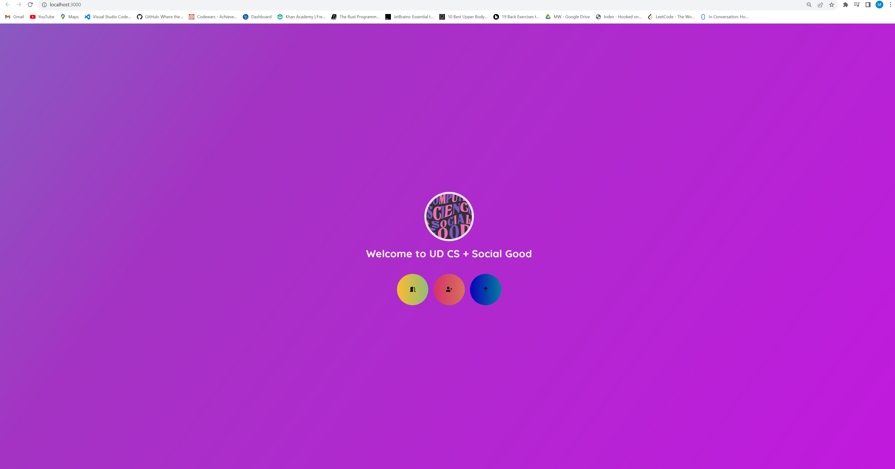

<h1>
UD-CS Social Good Website
</h1>

**A project for the University of Delaware's Computer Science for social good website**

By Maxwell Wang and Cameron Thacker

This website is an redo of the existing UD-CSSG Website. The exsiting CSSG site had issues when loading the page such it shows a white screen and no content is displayed. 

Key issues that are covered
<ul>
<li>
Loads the webpage upon accessing the website
</li>
<li>
Upon accessing the page (third button), the user is able to see a navigational bar with content
</li>
<li>
    User is able to see the design, know who the eboard of the club is, what events are there and what the club is
</li>
</ul>

**To Dos**
**Add more content on the navbars**
**Add mobile compability**
**Remove login and sign-up buttons as its a front-end only based website**
